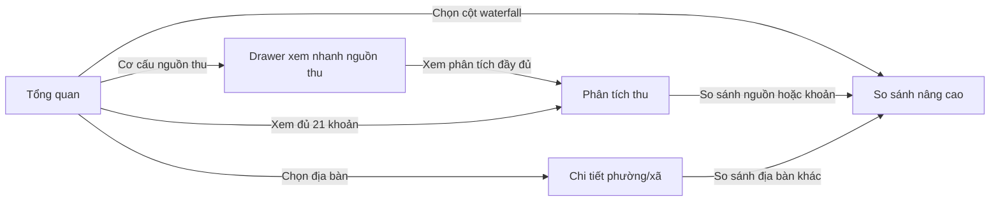

# Thiết kế Dashboard Thu NSNN

**Phiên bản:** 1.1

**Ngày cập nhật:** 14/09/2026

**Đặc tả nghiệp vụ tham chiếu:** `dac-ta-v2.html`

**Phạm vi:** UI/UX, kiến trúc frontend, URL state, API/MCP và mock data

## 1. Mục tiêu sản phẩm

Dashboard giúp người dùng theo dõi và phân tích thu ngân sách Nhà nước theo kỳ, nguồn thu,
khoản thu, cấp ngân sách và địa bàn.

Sản phẩm cần giúp người dùng trả lời nhanh bốn câu hỏi:

1. Kỳ này thu được bao nhiêu?
2. Kết quả thay đổi thế nào so với cùng kỳ?
3. Nguồn thu, khoản thu hoặc địa bàn nào đóng góp nhiều nhất?
4. Khu vực nào có tăng trưởng, suy giảm, bất thường hoặc thiếu dữ liệu?

Đây là một công cụ phân tích vận hành. Thiết kế ưu tiên khả năng quét nhanh, ý nghĩa số liệu,
trật tự thông tin và hành vi nhất quán.

## 2. Kiến trúc thông tin

Ứng dụng gồm bốn workspace chính:

| Tab | Câu hỏi chính |
|---|---|
| Tổng quan | Tình hình thu ngân sách toàn thành phố ra sao? |
| Phân tích thu | Nguồn hoặc khoản thu nào tạo ra kết quả đó? |
| Chi tiết phường/xã | Một địa bàn cụ thể đang hoạt động ra sao? |
| So sánh nâng cao | Hai kỳ, nguồn thu hoặc địa bàn khác nhau thế nào? |



Thứ tự tab:

```text
Tổng quan | Phân tích thu | Chi tiết phường/xã | So sánh nâng cao
```

## 3. Master layout

Thứ bậc giao diện từ trên xuống:

1. Header nhận diện hệ thống.
2. Thanh điều hướng bốn tab.
3. Bộ lọc theo ngữ cảnh của tab.
4. Dải KPI compact.
5. Workspace lưới 12 cột.
6. Drawer xem nhanh khi cần.

Thanh tab dùng `position: sticky` bên dưới header, không che nội dung. Tab hiện tại phải có
trạng thái active rõ ràng và hỗ trợ điều hướng bàn phím. Trên Mobile, tab cuộn ngang bằng
vuốt; trong preview desktop, kéo chuột phải mô phỏng được cùng thao tác mà không chọn nhầm tab.

## 4. Ngôn ngữ thị giác

- Giữ header xanh navy và nhận diện hiện có.
- Nền trang trung tính, surface dữ liệu màu trắng.
- Dùng border nhẹ thay cho shadow nặng.
- Màu xanh là màu dữ liệu chính.
- Xanh lá và đỏ chỉ thể hiện tăng/giảm có ý nghĩa.
- Không dùng màu làm dấu hiệu duy nhất.
- Không dùng gradient trang trí hoặc glass effect.
- KPI dạng dải compact, không dùng các card khổ lớn.
- Số liệu dùng tabular numerals.
- Chart grid line nhẹ và nằm sau dữ liệu.
- Control có trọng lượng thị giác thấp hơn nội dung phân tích.

Viewport 1440px đầu tiên cần hiển thị được tab, filter, KPI và phần đầu của biểu đồ chính.

## 5. Filter chung

```ts
type PeriodType = "MONTH" | "QUARTER";
type AccumulationMode = "PERIOD" | "YTD";
type BudgetLevel = "NSNN" | "NSTW" | "NSDP";

interface DashboardFilters {
  year: number;
  periodType: PeriodType;
  period: number;
  accumulation: AccumulationMode;
  indicator: string;
  budgetLevel: BudgetLevel;
}
```

Quy tắc:

- Filter chung được giữ khi chuyển tab.
- Mặc định chọn kỳ mới nhất thực sự có dữ liệu.
- Không chọn kỳ tương lai rồi biểu diễn dữ liệu thiếu thành 0.
- Khi đổi năm hoặc loại kỳ, phải kiểm tra lại kỳ đang chọn.
- Chỉ có một nơi sở hữu và đồng bộ URL state.
- Request cũ phải bị hủy khi filter thay đổi nhanh.
- Response cũ không được ghi đè kết quả mới.
- Web desktop rộng hiển thị điều khiển trực tiếp. Web dưới 768px, iframe và Mobile host
  dùng thanh tóm tắt hai nhóm `Kỳ báo cáo`/`Chỉ tiêu`.
- Khi mở, bốn trường đầu xếp hai cột; `Cấp ngân sách` và `Chỉ tiêu` dùng tỷ lệ 1/3–2/3.
  Dưới 340px, hai trường này xuống hai hàng.
- Nút `Đặt lại bộ lọc` nằm cuối panel, chiếm toàn bộ chiều rộng và khôi phục filter mặc định.
- Nếu Mobile host khai báo `openFilterModal`, nút lọc phát `NSNN_OPEN_FILTER`; nếu không,
  dashboard dùng panel HTML làm fallback.

Filter cục bộ như xếp hạng cao/thấp, tăng/giảm, lựa chọn 2–5 địa bàn hoặc chế độ chart nằm
trong header của widget và không thay đổi KPI toàn cục.

## 6. URL state

URL phải hỗ trợ mở trực tiếp, reload, chia sẻ, Back và Forward.

### Tổng quan

```text
?tab=overview&year=2026&periodType=MONTH&period=8&acc=PERIOD&level=NSNN&indicator=tong-so
```

### Drawer xem nhanh

```text
?tab=overview&panel=revenue-preview&source=domestic&year=2026&periodType=MONTH&period=8
```

Mở drawer dùng `history.pushState`. Back đóng drawer và giữ nguyên filter.

### Phân tích thu

```text
?tab=revenue-analysis&section=domestic&view=ranking&year=2026&periodType=MONTH&period=8&acc=PERIOD&level=NSNN
```

### Chi tiết địa bàn

```text
?tab=location-detail&location=00004&year=2026&periodType=MONTH&period=8
```

### So sánh nâng cao

```text
?tab=advanced-compare&mode=revenue&source=domestic&item=pit&periodA=2025m8&periodB=2026m8
```

```text
?tab=advanced-compare&mode=location&locationA=00004&locationB=00008&period=2026m8
```

## 7. Tab Tổng quan

Tổng quan luôn có phạm vi toàn thành phố, không đặt location selector vào filter chung.

```text
[ KPI Strip — 12 ]

[ Xu hướng — 8 ] [ Cơ cấu nguồn thu — 4 ]

[ Top khoản thu nội địa — 8 ] [ Top địa bàn — 4 ]

[ Tăng trưởng địa bàn — 6 ] [ Theo cấp ngân sách — 6 ]

[ So sánh nhanh 2–5 địa bàn — 12 ]

[ Waterfall biến động — 12 ]
```

Thẻ **Theo cấp ngân sách** gồm donut `NSTW/NSĐP` có thể chọn trực tiếp. Chọn NSTW hiển thị
phân rã theo bốn nguồn thu; chọn NSĐP hiển thị `NS cấp tỉnh`, `NS cấp xã`, `NS cấp huyện`.
Hai công thức bắt buộc là
`NSNN = NSTW + NSĐP` và `NSĐP = cấp tỉnh + cấp huyện + cấp xã`; số 0 hoặc số âm vẫn phải
hiển thị vì có thể là số điều chỉnh hợp lệ.

### KPI

1. Thu trong kỳ.
2. Lũy kế từ đầu năm.
3. Độ phủ địa bàn.
4. Cảnh báo hoặc insight quan trọng.

### Xu hướng

- Hiển thị 12 tháng.
- So sánh năm N và N-1.
- Tôn trọng PERIOD/YTD.
- Tháng thiếu hoặc tương lai là khoảng trống, không phải 0.
- Không nối đường qua dữ liệu null.

### Cơ cấu nguồn thu

Hiển thị bốn nguồn:

1. Thu nội địa.
2. Thu xuất nhập khẩu ròng.
3. Thu dầu thô.
4. Thu khác IV–VIII.

Click một nguồn mở drawer xem nhanh. Drawer có hành động `Xem phân tích đầy đủ` dẫn sang
tab Phân tích thu với đúng nguồn đang chọn.

### Khoản thu nội địa

- Mặc định Top 5.
- `Xem tất cả` dẫn tới Phân tích thu / Thu nội địa / BXH 21 khoản.
- Sử dụng đúng 21 khoản thu trong đặc tả v2.
- Không cộng đồng thời cha và con.

### Địa bàn

- Có toggle cao nhất/thấp nhất.
- Có toggle tăng mạnh/giảm mạnh.
- Hiển thị amount, tỷ trọng, delta và YoY khi hợp lệ.
- Click địa bàn dẫn tới Chi tiết phường/xã.

### Waterfall

- Có giá trị đầu, các bước lũy kế và giá trị cuối.
- Tổng delta phải khớp giá trị cuối trừ giá trị đầu.
- Click một cột dẫn sang So sánh nâng cao với context tương ứng.

## 8. Drawer xem nhanh nguồn thu

Drawer chỉ phục vụ xem nhanh, không thay thế workspace Phân tích thu.

Desktop:

```css
width: min(600px, 42vw);
```

Mobile dùng full-screen sheet.

Nội dung:

- Tên nguồn thu.
- Giá trị hiện tại.
- Tỷ trọng.
- YoY.
- Kỳ và cấp ngân sách.
- Nguồn dữ liệu và độ phủ.
- Biểu đồ xu hướng compact.
- Nút `Xem phân tích đầy đủ`.

Yêu cầu hành vi:

- Trap focus.
- Escape đóng drawer.
- Có nút đóng nhìn thấy được.
- Trả focus về nguồn thu đã bấm.
- Back của trình duyệt đóng drawer.
- URL trực tiếp mở đúng drawer.

## 9. Tab Phân tích thu

Đây là workspace phân tích độc lập. Dùng sub-navigation:

```text
Thu nội địa | Thu xuất nhập khẩu | Thu khác
```

```text
[ KPI nguồn thu — 12 ]

[ Xu hướng nguồn thu — 8 ] [ Cơ cấu nguồn thu — 4 ]

[ Bảng chi tiết — 8 ] [ Đóng góp địa bàn — 4 ]

[ Waterfall — 12 ]
```

KPI gồm giá trị, tỷ trọng, YoY và đóng góp vào biến động chung.

### Thu nội địa

- Bảng đủ đúng 21 khoản.
- Tìm kiếm và sắp xếp.
- Sort theo amount, tỷ trọng, YoY, tăng và giảm.
- Hiển thị current, previous, delta tuyệt đối, delta %, tỷ trọng và trend compact.

### Thu xuất nhập khẩu

Tách rõ tổng thu, hoàn/khấu trừ và thu ròng. Thu ròng phải đối chiếu được với các thành phần.

### Thu khác

Giữ các nhóm IV–VIII có thể nhận biết. Giá trị âm hợp lệ không bị loại.

### Điều hướng

Click một khoản hoặc cột waterfall có thể mở So sánh nâng cao ở `mode=revenue`.

## 10. Tab Chi tiết phường/xã

```text
[ Danh sách địa bàn có tìm kiếm — 5 ]
[ Bản đồ và phân tích địa bàn — 7 ]
```

Danh sách và bản đồ dùng chung một selected-location state.

Yêu cầu:

- Tìm kiếm tên tiếng Việt.
- Xếp hạng cao/thấp.
- Keyboard navigation.
- Hiển thị selected state rõ ràng.
- Không đưa dòng tổng thành phố hoặc tổng Kho bạc vào xếp hạng.
- Click bản đồ và click danh sách cho cùng kết quả.
- Có table alternative cho bản đồ.
- Không tạo ranh giới địa lý giả.

Phân tích địa bàn gồm KPI, xu hướng, cơ cấu nguồn thu, top khoản thu, coverage và nguồn dữ
liệu. Hành động `So sánh với địa bàn khác` dẫn sang `advanced-compare&mode=location`.

## 11. Tab So sánh nâng cao

```ts
type AdvancedComparisonMode = "period" | "revenue" | "location";
```

Mode selector:

```text
Theo kỳ | Theo nguồn thu | Theo địa bàn
```

```text
[ KPI so sánh — 12 ]

[ Waterfall — 7 ] [ Bảng delta — 5 ]

[ Xu hướng so sánh — 12 ]
```

KPI gồm giá trị A, giá trị B, delta tuyệt đối và delta phần trăm khi hợp lệ.

Bảng delta gồm tên đối tượng, A, B, delta tuyệt đối, delta %, hướng thay đổi và đóng góp vào
biến động chung.

Không cho phép so sánh các scope, unit, indicator hoặc cấp ngân sách không tương thích.

## 12. Dynamic grid

```ts
type ColSpan = 12 | 8 | 7 | 6 | 5 | 4;
```

Không dựng Tailwind class bằng chuỗi động. Dùng static map, CSS custom property hoặc
`gridColumn` sau khi validate.

Layout resolver phải mở rộng widget còn lại khi sibling `not-applicable` bị ẩn:

- 8 + 4: nếu widget 4 ẩn, widget 8 thành 12.
- 7 + 5: nếu widget 5 ẩn, widget 7 thành 12.
- 6 + 6: nếu một widget ẩn, widget còn lại thành 12.

Không dùng `grid-auto-flow: dense` vì làm sai thứ tự đọc và tab keyboard.

Responsive:

- Desktop từ 1280px: dùng span cấu hình.
- Tablet 768–1279px: dùng 6 hoặc 12 cột.
- Mobile dưới 768px: mọi widget 12 cột.
- Không có horizontal overflow ở cấp trang.

## 13. Trạng thái dữ liệu

```ts
type ResourceState<T> =
  | { status: "loading" }
  | { status: "ready"; data: T }
  | { status: "partial"; data: T; message: string }
  | { status: "no-data"; message: string; canChangeFilters: boolean }
  | { status: "not-applicable"; reason: string }
  | { status: "error"; message: string; retryable: boolean };
```

- 0 là dữ liệu hợp lệ.
- Số âm có thể hợp lệ.
- Null là thiếu hoặc chưa có.
- `not-applicable` loại widget khỏi grid.
- `partial` vẫn hiển thị dữ liệu. Không dùng banner coverage chung trên mọi tab; Tổng quan
  đưa số địa bàn thiếu vào KPI `Cần chú ý`, còn widget nào cần độ phủ phải đặt thông tin
  ngay cạnh số liệu liên quan.
- `error` có retry khi phù hợp.
- Loading giữ ổn định layout.
- Error Boundary chỉ xử lý lỗi render.

## 14. Quy tắc số liệu

- Không hiển thị NaN hoặc Infinity.
- Không tạo `-100%` từ dữ liệu previous bị thiếu.
- Không đổi null thành 0.
- Không cộng parent và child trong cùng một tổng.
- Dùng đúng 21 khoản nội địa.
- Không xếp hạng dòng tổng Kho bạc như địa bàn.
- YTD không được tính bằng cách cộng các YTD tháng.
- Quý dẫn xuất được cộng từ ba giá trị PERIOD tháng và phải có nhãn dẫn xuất.
- Waterfall phải reconciliation với tổng delta.
- Tăng trưởng loại các mẫu previous không hợp lệ hoặc quá nhỏ.
- Unit được chuẩn hóa một lần tại adapter.

## 15. MCP architecture

MCP chỉ trả dữ liệu và navigation intent đã được whitelist. MCP không được gửi component tùy
ý, JavaScript, HTML, CSS class, event handler hoặc URL thô.

```ts
type DashboardNavigationAction =
  | { type: "OPEN_REVENUE_PREVIEW"; sourceId: string }
  | {
      type: "OPEN_REVENUE_ANALYSIS";
      sourceId: string;
      view?: "overview" | "ranking" | "waterfall";
    }
  | { type: "OPEN_LOCATION_DETAIL"; locationId: string }
  | {
      type: "OPEN_ADVANCED_COMPARISON";
      mode: "period" | "revenue" | "location";
      entityIds: string[];
    };
```

Ứng dụng tự chuyển intent đã validate thành internal URL.

```ts
interface DashboardResponse {
  schemaVersion: "1.0";
  requestId: string;
  source: "api" | "mcp" | "fixture" | "mock";
  generatedAt: string;
  filters: DashboardFilters;
  page: {
    tab: "overview" | "revenue-analysis" | "location-detail" | "advanced-compare";
    section?: string;
    comparisonMode?: AdvancedComparisonMode;
  };
  widgets: DashboardWidgetConfig[];
  navigation?: DashboardNavigationAction[];
}
```

Toàn bộ envelope, metadata và widget payload phải được validate runtime trước khi render.

```ts
interface DashboardDataProvider {
  getOverview(filters: DashboardFilters, signal: AbortSignal): Promise<DashboardResponse>;
  getRevenueAnalysis(filters: DashboardFilters, scope: RevenueScope, signal: AbortSignal): Promise<DashboardResponse>;
  getLocationDetail(filters: DashboardFilters, locationId: string, signal: AbortSignal): Promise<DashboardResponse>;
  getAdvancedComparison(filters: AdvancedComparisonFilters, signal: AbortSignal): Promise<DashboardResponse>;
}
```

Tách riêng `ApiDashboardProvider`, `McpDashboardProvider` và `MockDashboardProvider`. Widget
không được biết dữ liệu đến từ provider nào.

## 16. Mock data

Nếu API chưa đủ, dùng deterministic mock provider để hoàn thiện prototype.

```ts
interface RevenueObservation {
  year: number;
  month: number;
  locationId: string;
  itemCode: string;
  sourceCode: string;
  budgetLevel: "NSTW" | "NSDP";
  amountVnd: number | null;
}
```

Mock cần phủ:

- Năm 2024–2026.
- Năm 2026 tới tháng 8.
- Tháng tương lai là null.
- Danh mục địa bàn thực có trong workspace.
- Đúng 21 khoản thu nội địa.
- Bốn nguồn thu cấp cao.
- NSTW và NSDP.
- Giá trị 0, số âm hợp lệ và dữ liệu thiếu.

KPI, trend, structure, ranking, table và waterfall phải được tính từ cùng base observations.
Không sinh số độc lập cho từng widget. Giao diện phải ghi rõ:

```text
Dữ liệu mô phỏng phục vụ prototype
```

Không trộn mock với tổng chính thức trong một phép tính.

## 17. Accessibility

- Tab và heading có semantic đúng.
- Filter dùng được bằng bàn phím.
- Focus nhìn thấy rõ.
- Touch target tối thiểu 44px trên mobile.
- Chart phức tạp có mô tả hoặc bảng thay thế.
- Loading/error được thông báo bằng `aria-live` phù hợp.
- Drawer trap focus, đóng bằng Escape và trả focus.
- Không truyền đạt ý nghĩa chỉ bằng màu.
- Đảm bảo tương phản WCAG AA.
- Tôn trọng `prefers-reduced-motion`.
- Giao diện dùng được ở zoom 200%.

## 18. Tiêu chí nghiệm thu

1. Điều hướng bốn tab hoạt động.
2. Global filter được giữ khi chuyển tab.
3. URL deep link và reload khôi phục đúng trạng thái.
4. Back đóng drawer đúng cách.
5. Tổng quan điều hướng đúng sang Phân tích thu và Chi tiết địa bàn.
6. Waterfall điều hướng sang So sánh nâng cao.
7. Drawer hiển thị đúng nguồn và có CTA đầy đủ.
8. Đủ đúng 21 khoản thu nội địa.
9. Null, zero và số âm được xử lý đúng.
10. Waterfall khớp tổng delta.
11. MCP payload không hợp lệ bị từ chối an toàn.
12. Request cũ không ghi đè request mới.
13. Không tràn ngang ở 390px, 1024px và 1440px.
14. TypeScript và production build thành công.
15. Không có lỗi JavaScript chưa xử lý trên luồng chính.
16. Không thẻ nào bị cắt nội dung ngang.
17. Các thẻ cùng hàng có chiều cao bằng nhau.
18. Một cột số chỉ sử dụng một đơn vị tiền.

## 19. Yêu cầu bàn giao

- UI bốn tab hoạt động đầy đủ.
- Drawer xem nhanh nguồn thu.
- URL state và navigation intent.
- Mock/API/MCP provider adapters.
- Runtime validation.
- Kiểm tra desktop, tablet và mobile.
- README mô tả cách chạy, provider đang dùng, giả định mock và giới hạn API.

Không để placeholder cho chức năng cốt lõi. Khi API thiếu, hoàn thiện luồng bằng mock data có
tính nhất quán và ghi nhãn rõ ràng.
