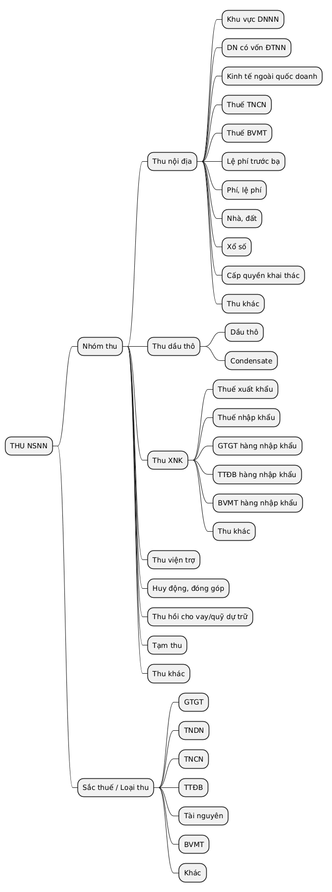
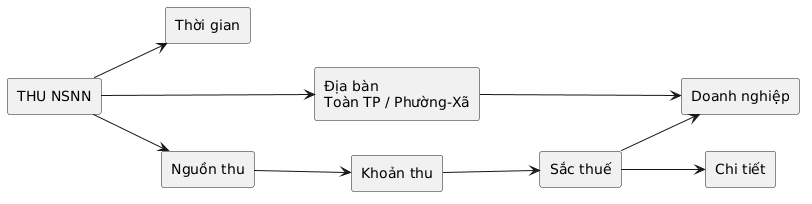

# Phân tích

# BÁO CÁO TỔNG HỢP

# Định hướng xây dựng Dashboard Nguồn thu ngân sách nhà nước

# 1. Mục tiêu

Dashboard được xây dựng nhằm theo dõi, phân tích và đánh giá tình hình **thu ngân sách nhà nước (NSNN)** trên địa bàn Hà Nội theo các chiều:

* Thời gian.
* Địa bàn hành chính.
* Nguồn thu.
* Khoản thu.
* Loại/sắc thuế.
* Doanh nghiệp, đặc biệt nhóm doanh nghiệp có số thu lớn.

Dashboard cần giúp người sử dụng nhanh chóng trả lời các câu hỏi:


1. Tổng thu NSNN hiện đạt bao nhiêu?
2. Đã hoàn thành bao nhiêu phần trăm dự toán?
3. Nguồn thu nào đang đóng góp lớn nhất?
4. Nguồn thu nào tăng hoặc giảm so với cùng kỳ?
5. Địa bàn nào có mức thu cao, thấp hoặc chưa đạt tiến độ?
6. Doanh nghiệp nào đóng góp lớn vào NSNN?
7. Khi đi sâu vào một nguồn thu, khoản thu hoặc địa bàn thì cơ cấu thu thay đổi như thế nào?

# 2. Cấu trúc phân cấp nguồn thu

Từ cấu trúc file Excel hiện có, đề xuất chuẩn hóa dữ liệu theo mô hình:

> **Thu NSNN → Nguồn thu → Khoản thu → Đối tượng/Sắc thuế → Chi tiết**

Trong đó:

### Cấp 1 – Thu NSNN

### Cấp 2 – Nguồn thu

Bao gồm các nhóm I đến VIII:

* I. Thu nội địa không kể dầu thô.
* II. Thu về dầu thô.
* III. Thu cân đối từ hoạt động xuất nhập khẩu.

  Các nhóm **Viện trợ, Huy động/đóng góp, Thu hồi cho vay, Tạm thu** có thể để trong **“Thu khác”**

### Cấp 3 – Khoản thu

```javascript
Thu nội địa
├── DNNN
├── DN có vốn ĐTNN
├── Kinh tế ngoài quốc doanh
├── Thuế TNCN
├── Thuế BVMT
├── Lệ phí trước bạ
├── Phí, lệ phí
├── Nhà, đất
├── Xổ số
├── Cấp quyền khai thác tài nguyên
├── Thu khác
└── Cổ tức, lợi nhuận, thu hồi vốn
```


```javascript
Thu dầu thô
├── Dầu thô
└── Condensate
```


```javascript
Thu XNK
├── Thuế xuất khẩu
├── Thuế nhập khẩu
├── GTGT hàng nhập khẩu
├── TTĐB hàng nhập khẩu
├── BVMT hàng nhập khẩu
└── Thu khác
```

### Cấp 4 – Sắc thuế/loại thu

Ví dụ:

* Thuế GTGT.
* Thuế TNDN.
* Thuế TNCN.
* Thuế TTĐB.
* Thuế tài nguyên.
* Thuế BVMT.

# 3. Sơ đồ phân cấp dữ liệu

 


---

# 4. Thiết kế bộ lọc

## 4.1. Bộ lọc chính

Đặt trên cùng Dashboard:

* Năm 
* Quý
* Tháng
* Địa bàn.
* Nguồn thu.

## 4.2. Bộ lọc địa bàn

Người dùng có thể chọn:

* Toàn Hà Nội.
* Một phường/xã.

Khi thay đổi địa bàn, toàn bộ KPI và biểu đồ tự động cập nhật.


## 4.3. Bộ lọc nguồn thu

Nguồn thu được lấy từ cấp I đến VIII của nhóm A.

Ví dụ:

> Tất cả\nThu nội địa không kể dầu thô\nThu về dầu thô\nThu cân đối từ hoạt động XNK\nThu viện trợ\nHuy động, đóng góp\nThu hồi cho vay...\nTạm thu\nThu khác

## 4.4. Bộ lọc phân tích nâng cao

* Khoản thu.
* Sắc thuế.
* Đối tượng/khu vực kinh tế.
* Doanh nghiệp.
* Nhóm doanh nghiệp lớn.

Các filter này có quan hệ phụ thuộc:

> $$
> \text{Nguồn thu (Cấp 2)} \xrightarrow{\text{lọc}} \text{Khoản thu (Cấp 3)} \xrightarrow{\text{lọc}} \text{Sắc thuế / Loại thu (Cấp 4)}
> $$

Ví dụ:

```
Nguồn thu:
Thu nội địa
        ↓
Khoản thu:
Thu từ khu vực ngoài quốc doanh
        ↓
Sắc thuế:
GTGT / TNDN / TTĐB / Tài nguyên
```

Không nên hiển thị toàn bộ sắc thuế nếu sắc thuế đó không thuộc khoản thu đang được lựa chọn.


# 5. Đề xuất bố cục Dashboard

## Khu vực 1 – Tổng quan

Gồm các KPI:

* Tổng thu NSNN 
* Thu cùng kỳ.
* Tăng/giảm so với cùng kỳ
* Lũy kế thực hiện 

Công thức cơ bản:


**Tăng trưởng cùng kỳ**

> (Thực hiện kỳ này - Thực hiện cùng kỳ) / Thực hiện cùng kỳ × 100%

## Khu vực 2 – Tiến độ và xu hướng 

Biểu đồ đường được sử dụng để theo dõi diễn biến thu

## **Khu vực 3 – Cơ cấu nguồn thu**

Mục tiêu: Xác định các nguồn thu đóng góp vào tổng thu.

* Thu nội địa.
* Thu dầu thô.
* Thu xuất nhập khẩu.
* Viện trợ.
* Huy động.
* Khác.

## Khu vực 4 – Phân tích địa bàn và doanh nghiệp

### **Top Phường/Xã theo số thu NSNN**

### **Top doanh nghiệp đóng góp NSNN**

## **Khu vực 5 – Phân tích khoản thu**

Mục tiêu: Xác định khoản thu đóng góp chính và khoản thu biến động.

* Thuế GTGT.
* Thuế TNDN.
* Thuế TNCN.
* Thuế TTĐB.
* Thuế tài nguyên.
* Thuế BVMT.
* Lệ phí trước bạ.
* Phí - lệ phí.
* Thu từ đất.
* Các khoản thu khác.

## **Khu vực 6 – Phân tích khu vực kinh tế**

Mục tiêu: Đánh giá đóng góp của các khu vực kinh tế vào NSNN.

* Doanh nghiệp nhà nước.
* Doanh nghiệp có vốn ĐTNN.
* Khu vực kinh tế ngoài quốc doanh.

Các chỉ tiêu: **Số thu, tỷ trọng, tăng/giảm so với cùng kỳ.**

# **6. Logic thay đổi Dashboard theo địa bàn**

## **Trường hợp 1: Toàn thành phố**

Trọng tâm:

> **Tổng quan nguồn thu của Hà Nội**

Hiển thị:

* Tổng thu.
* Cơ cấu nguồn thu.
* Xu hướng.
* Top khoản thu.
* Top Phường/Xã.
* Top doanh nghiệp.

## **Trường hợp 2: Phường/Xã**

Trọng tâm:

> **Đặc điểm nguồn thu của địa bàn được chọn**

Hiển thị:

* Tổng thu của Phường/Xã.
* Cơ cấu nguồn thu.
* Khoản thu chính.
* Sắc thuế chính.
* Xu hướng thu.
* Doanh nghiệp đóng góp lớn trên địa bàn nếu dữ liệu cho phép.

# 7. Sơ đồ luồng tương tác Dashboard


 


# 8. Hai hướng phân tích quan trọng

## 8.1. Phân tích theo địa bàn

Khi người dùng chọn:

> Hà Nội  → Phường/Xã

Dashboard chuyển trọng tâm sang câu hỏi:

> "Địa bàn này thu được bao nhiêu và nguồn thu chính là gì?"

Ví dụ:

```
Phường/Xã
   ↓
Tổng thu
   ↓
Nguồn thu
   ↓
Khoản thu
   ↓
Sắc thuế
```

Các chỉ tiêu quan trọng:

* Tổng thu.
* Tăng trưởng.
* Cơ cấu nguồn thu.
* Top khoản thu.
* So sánh với các phường/xã khác.


---

## 8.2. Phân tích doanh nghiệp lớn

Khi chọn một doanh nghiệp, dashboard chuyển trọng tâm sang:

> "Doanh nghiệp này đóng góp bao nhiêu cho NSNN và đóng góp từ nguồn/sắc thuế nào?"

Ví dụ:

```
Doanh nghiệp
     ↓
Tổng số nộp
     ↓
Nguồn thu
     ↓
Sắc thuế
     ↓
Xu hướng theo thời gian
```

Các chỉ tiêu:

* Tổng số nộp.
* Tỷ trọng trong tổng thu.
* Tăng/giảm cùng kỳ.
* Thuế GTGT.
* Thuế TNDN.
* Thuế TNCN.
* Thuế TTĐB.
* Các khoản thu khác.